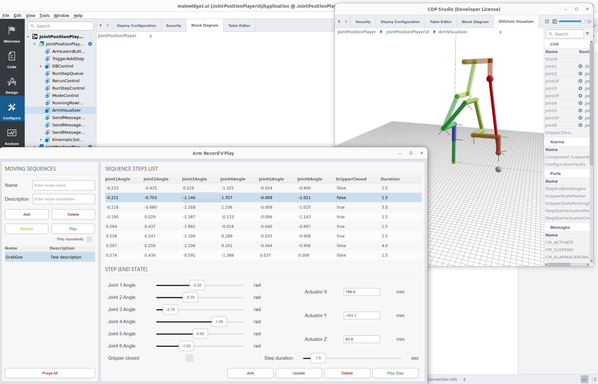

# Record'n'Play for myCobot 6-DOF robot arm

The Record'n'Play example system shows how CDP Studio can be used to control a myCobot 6-DOF robot arm.

Supported features:
* Position sequences can be recorded and then the sequence can be instructed to be "played back" by the arm
* Arm positions can be 3D-visualized, using CDP Studio and ArmVisualizer (DHChain Visualizer), which can be opened next to the GUI application (see the screenshot above)
* The system supports also the myCobot Adaptive Gripper that can be opened and closed in any step. The gripper is also simply visualized as a dot - using gray color when open and green color when closed.
* Most easiest way to record the steps is just to move the arm to any position and then press the button (LED panel) on the arm actuator
* Steps can also be configured without using the arm, just by configuring the desired joint angles (that uses CDP forward kinematics features) or the arm actuator x/y/z coordinates (that uses CDP inverse kinematics features) and by inspecting the resulting position in the 3D-visualizer pane.
* Any recorded position can be updated/adjusted later - i.e. step duration and the gripper open/closed state (in cases the gripper exists)
* The step sequence database is in simple SQLite format so it can be opened/modified/processed in any SQLite database editor for fine-tuning or programmatic sequence creation.

Dependencies:
* The system depends on the [myCobotLib](https://github.com/CDPTechnologies/myCobotLib) - the IOServer to interface with myCobot PI arms
* A myCobot arm with PI support (see https://www.elephantrobotics.com/en/mycobot-pi/)
* Optional myCobot arm Adaptive Gripper (see https://shop.elephantrobotics.com/products/adaptive-gripper)

Architecture:
* The system consists of two applications:
  * **RecordNPlayUI** - an application that runs the database logic and shows a GUI. It will be run on the controller machine that has a display (like the user's Linux or Windows desktop)
  * **RecordNPlayIO** - an application that will control the arm. It has to be configured in Studio to be run on the myCobot PI (using the ARMv6 64-bit toolkit).
